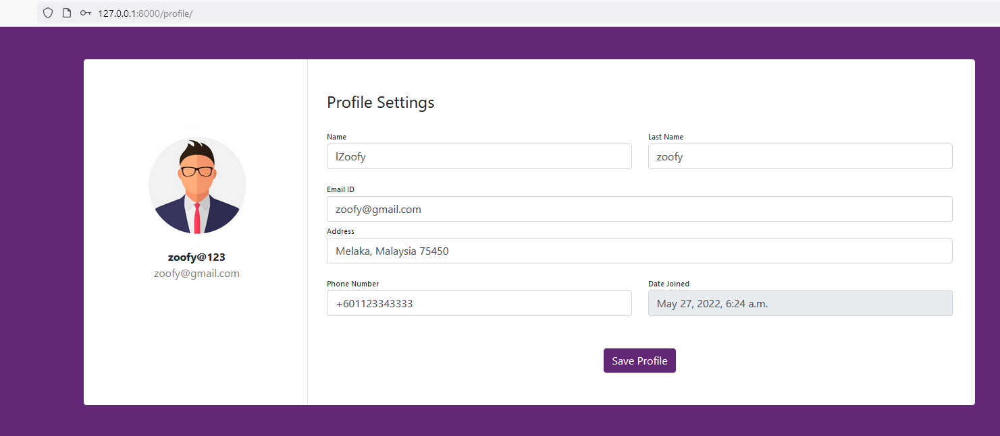
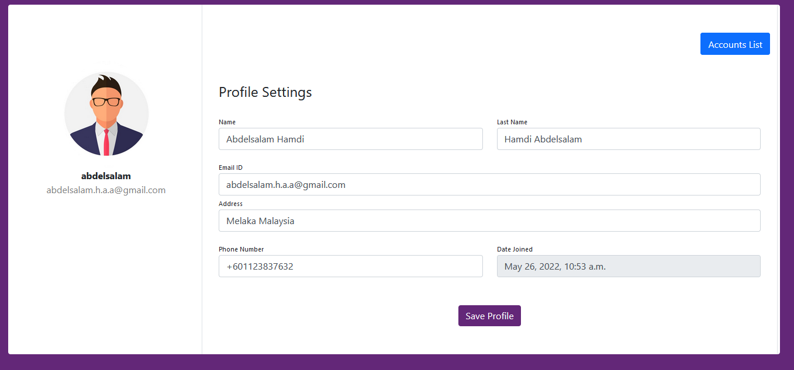
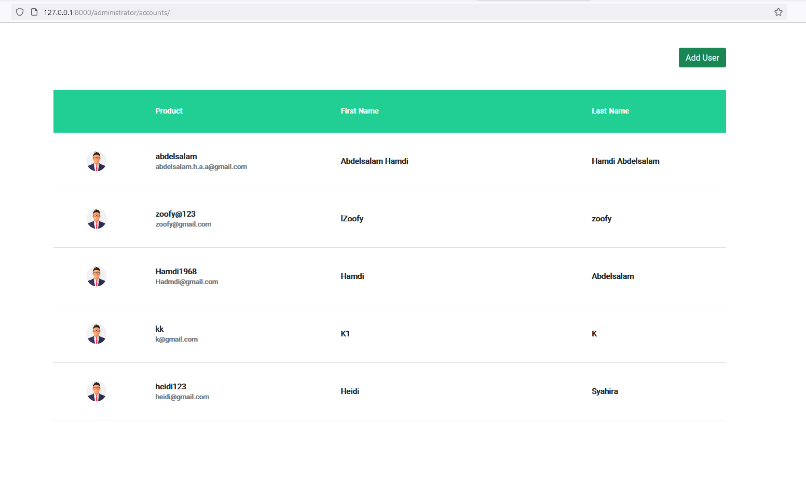
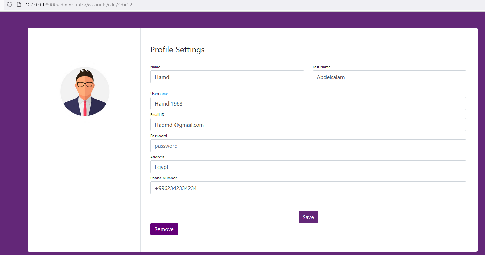

# The Access Group Assessment

A website is created using Django Frame work. 
The following pages are created

1- Landing page

2- Login page 

3- profile page to edit and view information 

4- account_list page for admin to view 

5- edit profile by admin (You need to click on the image beside the name in the list to edit that person information)


## Getting started

```
pip install -r requirements.txt
cd accessGroup
python manage.py runserver
```

## Demo


Loging in as normal User 

logging as admin 

List of user 

Click the image on the left at each user to edit



